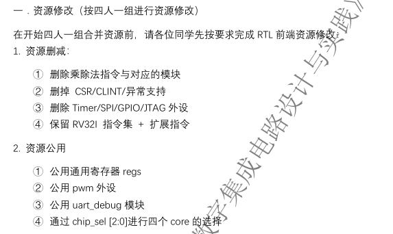
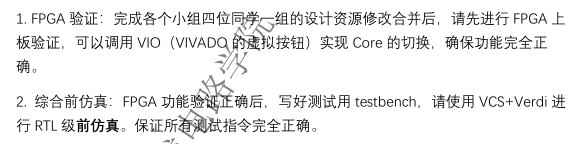

# Tinyriscv_g11
Project for Digital Design and Practice

|  编号  | 任务 | 时间 | 分工 | 输出 |
| ---  |   ---   | --- | --- | --- |
|1|RTL修改| 2026.07.24 - 2026.07.27 | 各自完成RTL代码修改、仿真验证 | 各自验证正确的rtl文件、filelist、FPGA报告 |
|2|RTL合并| 2026.07.28 - 2026.07.31 | 完成RTL代码的合并和仿真验证：①负责集成，②写TB，③对四人的设计进行综合 | 

## Mission 1 完成各自RTL代码的删减修改

如上图所示，是对各小组成员中RTL设计代码的修改要求，请大家按照上述要求对代码进行修改，修改并验证完成之后，将各自的代码push至根目录rtl\中的对应文件夹中，具体的要求如下：

1. 按照要求删除相关的资源，保证顶层的接口统一，如果没有自主的创新点，接口统一只有clk、rst、succ、uart_debug_pin、uart_tx_pin、uart_rx_pin、io_sda、io_scl、pwm_o等信号；
2. 删除资源之后，在本地对删减后的代码进行仿真验证，确保能通过基础的指令测试集（BasicTest），所有的拓展指令集（RT指令、SenID指令、IF指令），以及外设测试（IIC和PWM）正确；
3. 如果仿真正确，在FPGA上运行测试指令集，同验收一样，确保能通过测试；
4. 为设计添加filelist
5. 完成所有修改并确保正确后，请将代码上传至根目录rtl\中的对应文件夹，比如刘德凯上传至rtl\ldk中，**并给出filelist和FPGA报告（方便了解各自设计，有助于集成，可删除敏感信息）**

## Mission 2 完成代码的merge，仿真验证通过

如上图所示，我们需要对各自的RTL代码进行合并，据助教说，难点在于共享资源的商定，顶层IO这些问题上。同样在集成完成之后，我们还是需要进行仿真验证和FPGA验证，任务1大家可以复用自己原来的TB文件，但是merge之后的TB需要重新写，目标是测试四个芯片都可以正确工作，通过各项测试。同时我们还需要对大家各自的设计进行逻辑综合，以减少顶层综合时的压力，四人大致的分工如下：
1. 一人负责代码的merge
2. 一人负责写TB文件，协助FPGA验证
3. 剩余两人负责对四个人的设计文件进行综合，筛查综合的warning和error

